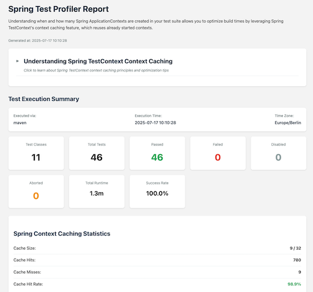
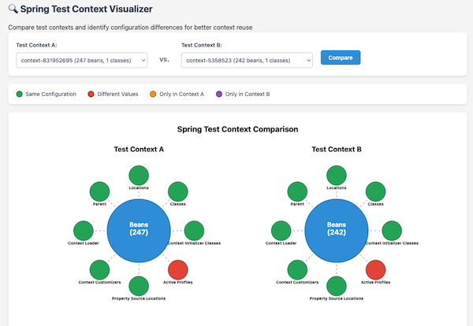

# Profile Your Tests. Speed Up Your Tests. Ship Faster 🚤

<p align="center">
  
</p>

A Spring Test utility that provides visualization and insights for Spring Test execution, with a focus on Spring context caching statistics.

Find [more information](https://pragmatech.digital/products/spring-test-profiler/) about the profiler on our website.

## Features

**Overall goal**: Identify optimization opportunities in your Spring Test suite to speed up your builds and ship to production faster and with more confidence 🚤

<p align="center">
  
</p>
<br/>
<p align="center">
  
</p>

This profiler helps you:

- Track Spring Test context caching statistics for your test suite
- Show context reuse metrics and cache hit/miss ratios
- Identify tests that couldn't reuse contexts and explain why
- Easy integration with a `spring.factories` file or `@TestExecutionListeners` annotation
- Works with both Maven Surefire/Failsafe and Gradle test tasks

## Requirements

[](https://github.com/PragmaTech-GmbH/spring-test-profiler/actions/workflows/ci.yml?query=branch%3Amain)

This profiler works with Java 17+ and is compatible with Spring Framework 6.X (aka. Spring Boot 3.X).

## Prototype Phase

> [!WARNING]
> This project is highly work-in-progress and should be considered a prototype to gather feedback and ideas for future development.

What's currently not working or missing:

- Support for parallel test execution
- Fully-fledged visualization of the contexts on a timeline
- For each Gradle test task, a separate HTML report is generated
- For Surefire and Failsafe, a separate HTML report is generated

## Usage

[](/spring-test-profiler-extension/pom.xml)

### 1. Add the Dependency

#### Quick Start Maven

Add the dependency to your project:

```xml
<dependency>
  <groupId>digital.pragmatech.testing</groupId>
  <artifactId>spring-test-profiler</artifactId>
  <version>0.0.12</version>
  <scope>test</scope>
</dependency>
```

#### Quick Start Gradle

Add the dependency to your project:

```groovy
testImplementation('digital.pragmatech.testing:spring-test-profiler:0.0.12')
```


### 2. Activate the Profiler

Pick **either one** of the following methods to activate the profiler in your tests.

#### Automatically for all Your Tests (Recommended)

Add a file named `META-INF/spring.factories` to your resources directory with the following content:

```text
org.springframework.test.context.TestExecutionListener=\
digital.pragmatech.testing.SpringTestProfilerListener
org.springframework.context.ApplicationContextInitializer=\
digital.pragmatech.testing.diagnostic.ContextDiagnosticApplicationInitializer
```

#### Manually for Specific Tests

Add the `@TestExecutionListeners` and `@ContextConfiguration` annotations to your test classes:

```java
@TestExecutionListeners(
  value = {SpringTestProfilerListener.class},
  mergeMode = TestExecutionListeners.MergeMode.MERGE_WITH_DEFAULTS
)
@ContextConfiguration(initializers = ContextDiagnosticApplicationInitializer.class)
```

This needs to be done for each test class where you want to use the profiler. Preferably, use this on a central abstract integration test class or use the automatic activation method above.

### 3. Run Your Tests

Execute your tests:

```bash
# Maven
./mvnw verify

# Gradle
./gradlew build
```

### 4. Analyze the Generated Report

After test execution, find the HTML report at:

- Maven: `target/spring-test-profiler/latest.html`
- Gradle: `build/spring-test-profiler/latest.html`

## Demo Report

Access a demo Spring Test Profiler report [here](https://pragmatech.digital/products/spring-test-profiler/).

## Bug Reports

Found a bug? Please help us improve by reporting it:

1. **Search existing issues** at https://github.com/PragmaTech-GmbH/spring-test-profiler/issues
2. **Create a new issue** with:
   - Clear description of the problem
   - Steps to reproduce
   - Expected vs actual behavior
   - Java/Spring/JUnit versions
   - Relevant log output or screenshots

## Contributing

We welcome contributions! Here's how to get started:

### Development Setup

1. **Fork and clone** the repository
2. **Activate pre-commit hooks** (this ensures compliant code formatting): `pre-commit install` ([pre-commit download](https://pre-commit.com/))
3. **Build the project**:

```bash
./mvnw install
```

3. **Run tests**:

```bash
./mvnw test
```

4. Use conventional commit messages for your changes (e.g., `feat: add new feature`, `fix: resolve issue #123`)
