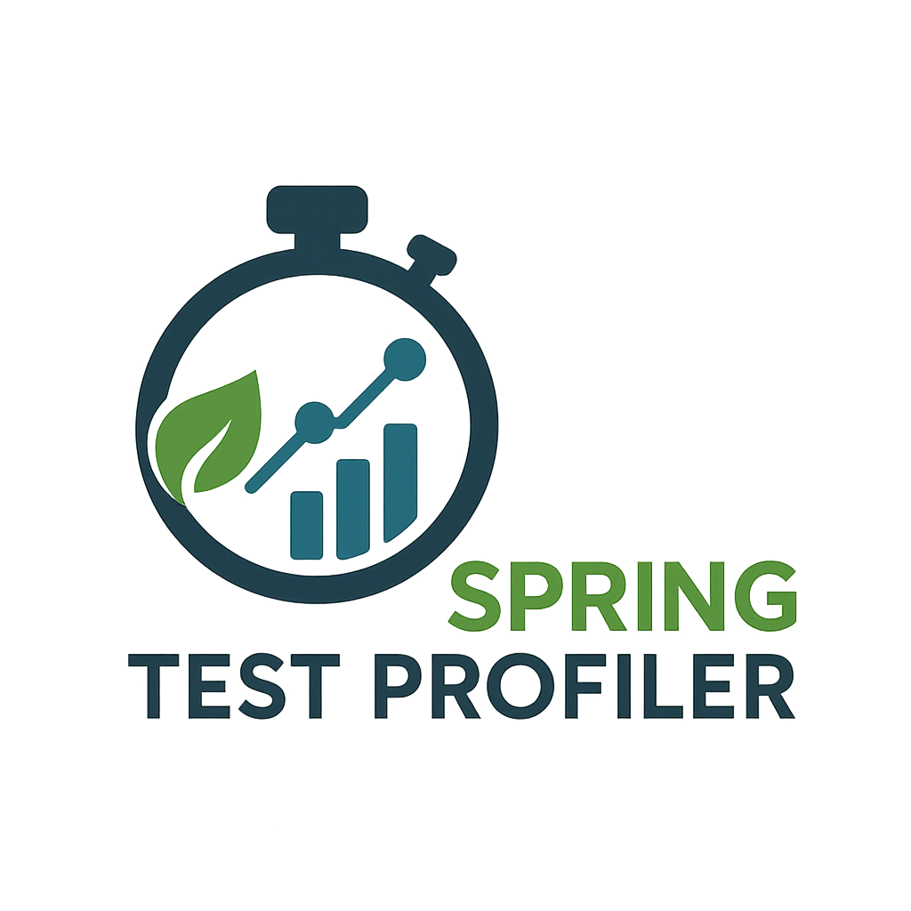

---



# Spring Test Profiler

### Profile & Improve Your Spring Tests for Faster and More Confident Production Deployments

<!--
PRESENTER NOTES:
- Welcome viewers with energy
- Introduce yourself briefly
- Set the stage: "Today I'll show you a tool that can dramatically speed up your Spring tests"
- Transition: "But first, let's talk about a problem every Spring developer faces..."
-->

---

<!-- header: 'Spring Test Profiler' -->
<!-- footer: '' -->


# The Problem

## Spring developers waste hours every week waiting for slow test suites

- Context switching during long test runs
- Delayed feedback on code changes
- Slower CI/CD pipelines affecting deployments
- Reduced confidence in making frequent commits

<!--
PRESENTER NOTES (45 seconds):
- Show split screen concept: frustrated developer vs happy developer
- Emphasize the pain: "Imagine waiting 5 minutes for tests that could run in 30 seconds"
- Real impact: "This isn't just about time - it's about your productivity and confidence"
- Hook: "What if I told you there's a hidden optimization in Spring that most developers don't know about?"
-->

---


# The Hidden Solution

## Spring TestContext Cache

Your tests are like web pages, contexts are like cached resources

**✅ 3 test classes sharing 1 context = Fast**
**❌ 3 test classes creating 3 contexts = Slow**

Cache keys affected by: `@TestPropertySource`, `@MockBean`, `@Profile`

<!--
PRESENTER NOTES (30 seconds):
- Use browser cache analogy: "Just like browsers cache resources to load pages faster"
- Show simple visual: 3 tests sharing vs creating separate contexts
- Quick mention of cache key factors
- The gap: "Spring has this powerful feature, but how do you actually see what's happening?"
-->

---


# Context Sharing Example

## When contexts get reused vs recreated

**Shared Context (Good)**
```java
@SpringBootTest
class UserServiceTest { }

@SpringBootTest
class OrderServiceTest { }
```

**Separate Contexts (Bad)**
```java
@SpringBootTest
class UserServiceTest { }

@SpringBootTest
@TestPropertySource(properties = "debug=true")
class OrderServiceTest { }
```

<!--
PRESENTER NOTES (30 seconds):
- Show concrete code examples
- Point out the tiny difference that breaks caching
- "This one line creates a completely new context"
- Transition: "Now you see the problem, but how do you find these issues in your own code?"
-->

---


# Spring Test Profiler

## The missing observability layer for your Spring tests

- **Zero Configuration** - Add dependency, run tests
- **Beautiful Visualizations** - Timeline, statistics, insights
- **Actionable Insights** - Specific optimization recommendations
- **Universal Compatibility** - Any Spring Boot version

<!--
PRESENTER NOTES (30 seconds):
- Hero moment: "Meet Spring Test Profiler"
- Emphasize key value props quickly
- "In just one dependency, you get complete visibility into your test performance"
- Transition: "Let me show you exactly how this works with a real project"
-->

---

# Live Demo: Setup


## Realistic Spring Boot App
REST API with database, mix of test types

## Before State: Slow Tests
```bash
mvn test
# Tests run: 12, Time: 47.2s
```

## One-Line Integration
```xml
<dependency>
  <groupId>digital.pragmatech.testing</groupId>
  <artifactId>spring-test-profiler</artifactId>
  <version>0.0.10</version>
  <scope>test</scope>
</dependency>
```

<!--
PRESENTER NOTES (30 seconds):
- Show realistic complexity: "This isn't a toy example"
- Emphasize the "before" timing: "47 seconds for 12 tests"
- Show how simple the integration is: "Just one dependency"
- "No configuration files, no annotations, no setup code"
-->

---

# The Magic: Report Generation


## Automatic Activation
```bash
mvn test
# Spring Test Profiler activated
# Report generated: target/spring-test-profiler/latest.html
```

## What You Get
- Timeline visualization of test execution
- Context cache statistics and hit/miss ratios
- Memory usage patterns during test runs
- Specific optimization recommendations

<!--
PRESENTER NOTES (30 seconds):
- Show the profiler automatically activating
- Point out the generated report location
- Highlight key report features
- "Everything you need to understand your test performance in one beautiful report"
-->

---

# Optimization in Action


## Problem Identified
Report shows: "Test classes creating separate contexts due to different @MockBean configurations"

## Quick Fix Applied
```java
// Before: Separate @MockBean in each test
// After: Shared @TestConfiguration
@TestConfiguration
static class TestConfig {
  @MockBean PaymentService paymentService;
  @MockBean NotificationService notificationService;
}
```

## Results: 47s → 12s (3x faster!)

<!--
PRESENTER NOTES (60 seconds):
- Show specific problem identification from report
- Demonstrate the actual code change
- Emphasize how small the change was
- Big reveal of results: "3x performance improvement with one small change"
- "This is the power of understanding what's actually happening in your tests"
-->

---

# Advanced Features

- **🔄 Parallel Execution** - Full support for JUnit parallel tests
- **📊 JSON Export** - CI/CD integration ready
- **🔧 Build Tools** - Maven & Gradle support
- **🌱 Compatibility** - Spring Boot 2.x - 3.x

<!--
PRESENTER NOTES (30 seconds):
- Quick run through advanced features
- Mention CI/CD integration possibilities with JSON export
- Emphasize broad compatibility
- "Whether you're on older Spring Boot versions or the latest, this tool works"
-->

---


# Get Started Today

## GitHub Repository
**github.com/rieckpil/spring-test-profiler**

## Easy Start
1. Add one dependency
2. Run your tests
3. Get insights immediately

## Join the Community
Developers already optimizing their test suites

**⭐ Star on GitHub**

<!--
PRESENTER NOTES (30 seconds):
- Clear call to action with GitHub link
- Reinforce how simple it is to get started
- Community appeal: "Join other developers who are already getting value"
- "Don't let slow tests slow you down - try Spring Test Profiler today"
- End with energy and clear next steps
-->
